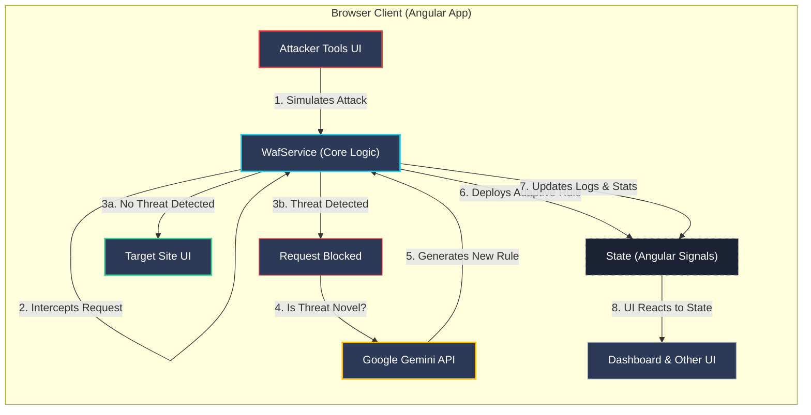

# **GuardX**
## AI-Powered Adaptive Web Application Firewall

**COSC Hackathon - Team 281**

Vasanthadithya, Harini, Manpreet, Ridhima, Srinath

---

## The Problem: The Limits of Traditional Firewalls

Traditional Web Application Firewalls (WAFs) are reactive. They rely on **signature-based detection**:
-   They need a pre-defined list of known attack patterns.
-   They are vulnerable to **zero-day exploits** and **obfuscated attacks**.
-   Updating rulesets is often a slow, manual process.
-   They struggle to keep pace with the creativity of modern attackers.

**Result:** A constant, reactive cycle of patching vulnerabilities after they've been discovered.

---

## The Proposed Solution: GuardX

An intelligent, **adaptive** WAF that learns from threats in real-time.

**Core Idea:** Leverage the analytical power of Large Language Models (LLMs) to move from a reactive to a **proactive security posture**.

1.  **Detect & Block:** Identify and block attacks, including suspicious, unclassified payloads.
2.  **Analyze with AI:** Send novel malicious payloads to the Google Gemini API for deep analysis.
3.  **Adapt Defenses:** Automatically generate and deploy a new, dynamic security rule based on the AI's analysis.
4.  **Harden in Real-Time:** The firewall becomes stronger with every new attack it encounters.

---

## ⚙️ Technology Stack

-   **Frontend Framework**: **Angular (v20+)**
    -   *Why?* Modern, performant, and excellent for complex single-page applications. Utilizes standalone components and zoneless change detection for maximum efficiency.
-   **State Management**: **Angular Signals**
    -   *Why?* A fine-grained, reactive system perfect for a dashboard with many interdependent, frequently updating parts.
-   **AI Engine**: **Google Gemini API**
    -   *Why?* Advanced reasoning capabilities for analyzing malicious code and generating structured, reliable JSON output for new security rules.
-   **Data Visualization**: **D3.js**
    -   *Why?* The industry standard for creating powerful, interactive data visualizations like our live global threat map.
-   **Styling**: **Tailwind CSS**
    -   *Why?* A utility-first CSS framework that allows for rapid, consistent, and modern UI development.

---

## 🏛️ System Architecture

This diagram illustrates the flow of a simulated attack within the self-contained GuardX application, from initiation to AI-driven rule adaptation and UI update.

---

## 💻 Implementation Highlights

-   **Modular, Component-Based UI:** Each feature (Dashboard, Attacker Tools, Threat Map) is an independent Angular component, making the system easy to manage and scale.
-   **Centralized State Service:** A single `WafService` holds all application state (logs, stats, rules) using Signals. This provides a single source of truth and ensures UI consistency.
-   **Real-Time Interactivity:**
    -   The Attacker Toolkit directly calls the `WafService`.
    -   The WAF's response (block/allow) immediately updates the state.
    -   All UI components subscribed to that state re-render instantly, creating a fluid, real-time simulation.

---

## 🧗 Challenges & Outcomes

-   **Challenge:** Creating a realistic but safe simulation of web attacks entirely on the client side.
    -   **Outcome:** We built a fully contained ecosystem where "Attacker," "WAF," and "Target" are distinct components that communicate via a central service, perfectly mimicking a real network flow without any backend complexity.

-   **Challenge:** Ensuring the AI consistently provides accurate, well-formatted rule descriptions.
    -   **Outcome:** We engineered highly specific prompts for the Gemini API, using its JSON output mode with a defined schema to guarantee reliable, parsable responses for seamless integration.

---

## 📈 Impact & Use Cases

-   **Security Operations:** A proof-of-concept for next-gen Security Operations Centers (SOCs), where AI assists human analysts by automating the initial response to novel threats.
-   **Educational Tool:** An excellent platform for teaching cybersecurity concepts. Students can safely launch attacks, see them get blocked, and immediately understand how the firewall adapted.
-   **Developer Awareness:** Demonstrates to web developers the importance of input sanitization and security best practices by visualizing the consequences of vulnerabilities at different security levels.

---

## Thank You

**Questions?**
