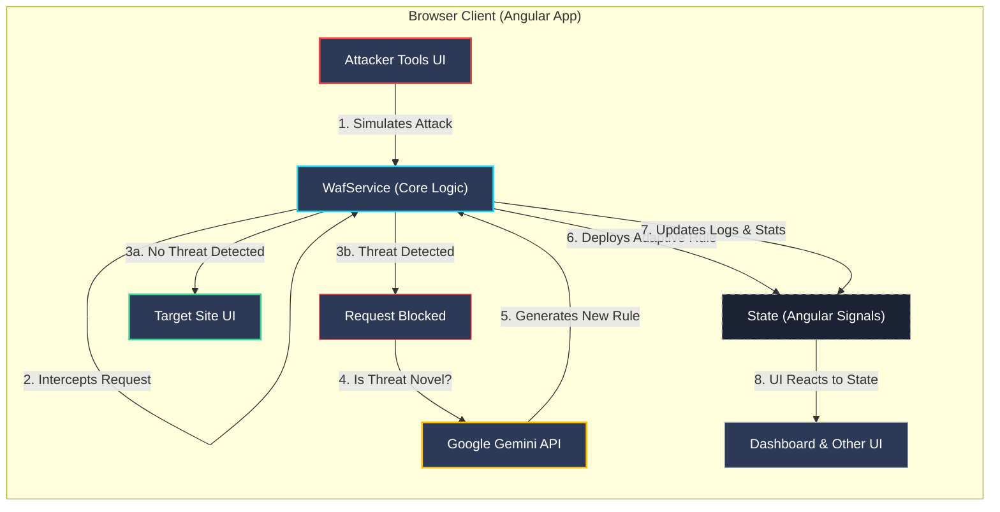

# GuardX: AI-Powered Adaptive Web Application Firewall

<p align="center">
  <strong>An intelligent, adaptive Web Application Firewall (WAF) that proactively detects and mitigates unknown threats by dynamically generating security rules in real-time.</strong>
</p>

<p align="center">
  
  
  
  
  
</p>

---

## 📜 Table of Contents

- [Introduction](#-introduction)
- [✨ Key Features](#-key-features)
- [🚀 Live Demo Components](#-live-demo-components)
- [⚙️ System Architecture](#️-system-architecture)
- [🛠️ Technology Stack](#️-technology-stack)
- [▶️ Running Locally](#️-running-locally)
- [👥 The Team](#-the-team-team-no--281)

---

## 📖 Introduction

GuardX is a high-fidelity simulation of a next-generation Web Application Firewall. It moves beyond the limitations of traditional, signature-based WAFs by leveraging the power of Large Language Models (LLMs) to create a proactive, self-improving security system. This project, developed for the **COSC - Hacktoberfest : Hackathon**, demonstrates how modern AI can analyze novel threats and dynamically harden a system's defenses in real-time.

## ✨ Key Features

-   **Real-Time Security Dashboard**: A central command center providing a comprehensive overview of security metrics, including total requests, threats detected/blocked, top attack vectors, and system uptime.
-   **Live Global Threat Map**: A stunning D3.js world map visualizing the geographic origin of incoming threats, providing an immediate sense of the global security landscape.
-   **Adaptive Defense Engine**: The core of GuardX. When the WAF blocks an unknown or novel threat, it uses the **Google Gemini API** to analyze the malicious payload and automatically generates a new, dynamic security rule to protect against similar attacks in the future.
-   **Variable Security Levels**: Instantly switch the WAF's protection level between **Low**, **Medium**, and **High** to observe how different security postures affect the outcome of simulated attacks against a target application.
-   **Interactive Attacker Toolkit**: A built-in suite of tools to simulate common web attacks, including Cross-Site Scripting (XSS), SQL Injection (SQLi), Path Traversal, and Brute-Force attacks.
-   **AI-Powered Payload Generation**: A powerful sandbox where users can describe an attack in natural language (e.g., "steal user cookies"). The Gemini API then generates a functional payload tailored to bypass the target's current security level.
-   **Simulated Server Terminal**: An interactive terminal environment providing diagnostic information about the server and WAF, including a live log viewer (`cat logs/waf.log`) and a simulated `nmap` port scan.

## 🚀 Live Demo Components

The GuardX interface is divided into several interactive modules:

-   **Dashboard**: The main overview of all security analytics.
-   **Live Traffic**: A real-time, streaming log of all requests being processed by the WAF.
-   **Threat Model**: An educational page detailing the types of threats GuardX is designed to mitigate (XSS, SQLi, etc.).
-   **About**: Information about the project, its purpose, and the development team.
-   **Target Site**: A simulated e-commerce website that serves as the attack target. Its behavior and vulnerability change based on the selected security level.
-   **Attacker Tools**: A control panel for launching pre-configured or custom attacks against the Target Site.
-   **Server Terminal**: A simulated command-line interface for the underlying server.
-   **Adaptive Defense**: The control center for the AI engine, showing dynamically generated rules and providing sandboxes for AI-powered payload generation and analysis.

## ⚙️ System Architecture

GuardX operates as a self-contained, client-side simulation. This design allows for a safe yet realistic demonstration of WAF principles without requiring a complex backend infrastructure.



1.  **Attacker Simulation**: The "Attacker Tools" view initiates a simulated web request.
2.  **WAF Service Interception**: An Angular service (`WafService`) acts as the central firewall. It intercepts all simulated requests before they can reach the "Target Site."
3.  **Threat Analysis & Action**:
    -   The service first checks the request against its current ruleset (static + adaptive).
    -   If a threat is identified, the request is **Blocked**. If the threat is novel, the payload is sent to the Gemini API.
    -   If no threat is found, the request is **Allowed** and passed to the Target Site component.
4.  **AI-Powered Rule Generation**:
    -   The Gemini API receives the malicious payload and a specialized prompt asking it to analyze the attack and create a mitigating rule description.
    -   The generated rule is received by the `WafService` and added to the list of active "Adaptive Rules."
5.  **State Management & UI Update**: All state changes (new logs, new rules, stats updates) are managed using Angular Signals. The UI components react instantly to these changes, providing a seamless and real-time experience.

## 🛠️ Technology Stack

-   **Frontend Framework**: Angular (v20+)
-   **Core Language**: TypeScript
-   **Styling**: Tailwind CSS
-   **AI & Machine Learning**: Google Gemini API (`@google/genai`)
-   **Data Visualization**: D3.js & TopoJSON
-   **State Management**: Angular Signals
-   **Core Principles**: Standalone Components, Zoneless Change Detection for optimal performance.

## ▶️ Running Locally

To run this project, you need a modern web browser and a way to serve the files.

1.  **Clone the repository:**
    ```bash
    git clone <repository-url>
    ```
2.  **Set up your API Key:**
    -   The application is configured to use an environment variable for the Google Gemini API key. In a real development environment, you would set `process.env.API_KEY`.
    -   For a simple local setup, you can temporarily modify `src/services/waf.service.ts` and replace `process.env.API_KEY` with your actual key string.
    ```typescript
    // In src/services/waf.service.ts
    // IMPORTANT: For local testing only. Do not commit your key.
    this.ai = new GoogleGenAI({ apiKey: 'YOUR_API_KEY_HERE' }); 
    ```
3.  **Serve the application:**
    -   The easiest way is to use a simple HTTP server. If you have Node.js installed, you can use `serve`:
    ```bash
    npm install -g serve
    serve .
    ```
    -   Navigate to the provided local URL (e.g., `http://localhost:3000`) in your browser.

## 👥 The Team (TEAM NO- 281)

This project was brought to life by a dedicated team of developers for the COSC Hackathon.

-   **Vasanthadithya** (160123749049)
-   **Harini** (160123749015)
-   **Manpreet** (160123749013)
-   **Ridhima** (160123749018)
-   **Srinath** (160123749303)
